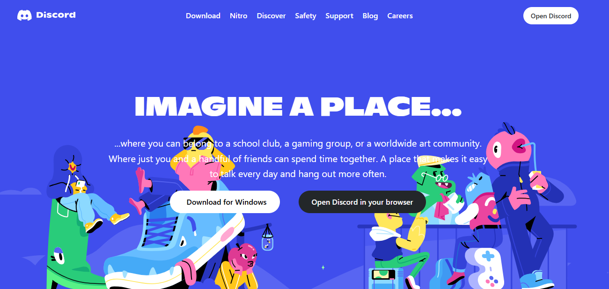
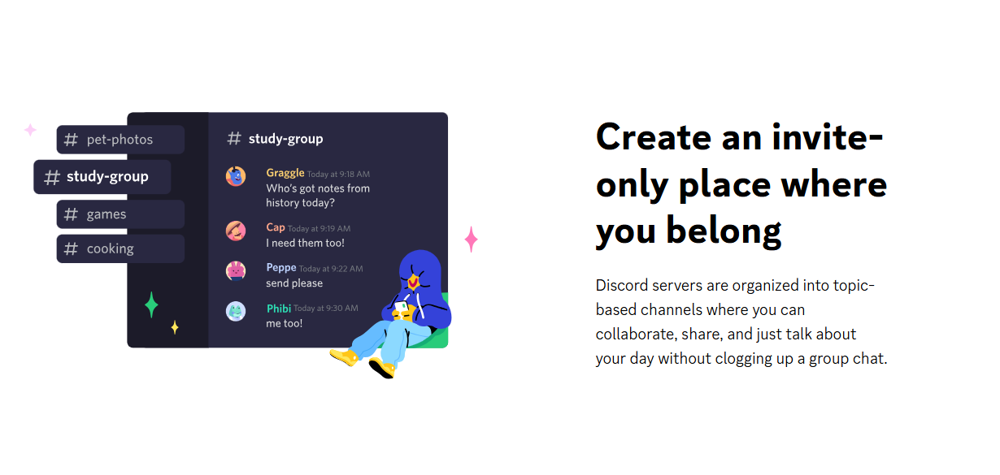
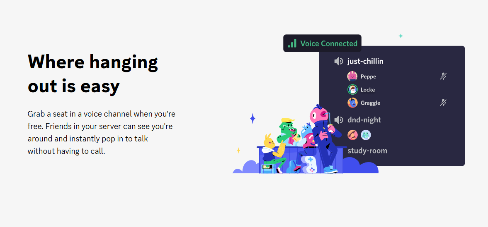
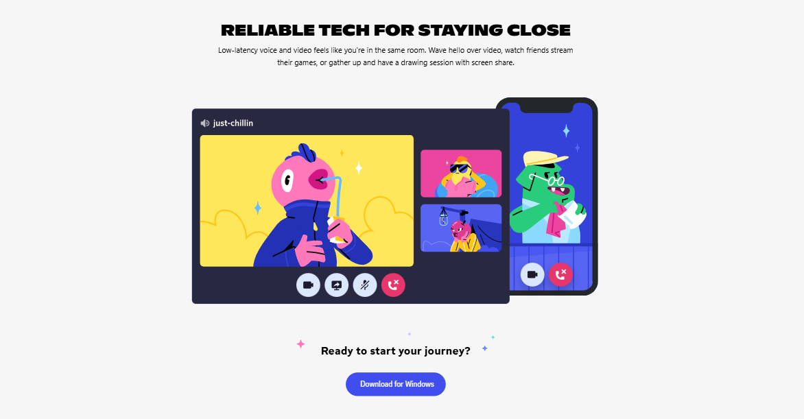

## Discord Clone  

Welcome to the **Discord Clone Project**, a sleek and modern web interface inspired by the popular communication platform Discord. This project is built using **HTML** and **Tailwind CSS**, showcasing my ability to replicate professional designs and implement responsive layouts.  

## Features  

- **Landing Page**: A visually engaging home page that mirrors the aesthetics of Discord, featuring sleek design and interactive elements.  
- **Download Options**: Dedicated sections with buttons to download the Discord app for **Windows** or **Open discord in your browser**, mimicking the official website's functionality.  
- **Description Section**: A detailed area explaining what Discord is, highlighting its features and benefits for users.  
- **Responsive Design**: Fully optimized for desktop, tablet, and mobile screens, ensuring a seamless user experience.  

## Technologies Used  

- **HTML:** For creating the foundational structure of the webpage.  
- **Tailwind CSS:** For rapid styling and achieving a professional design with minimal effort.  

### Screenshots  
  
  
  
  
